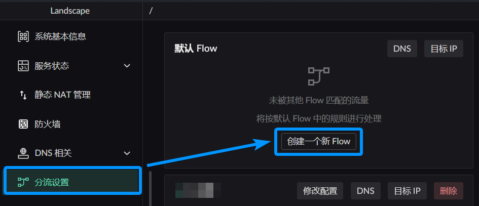
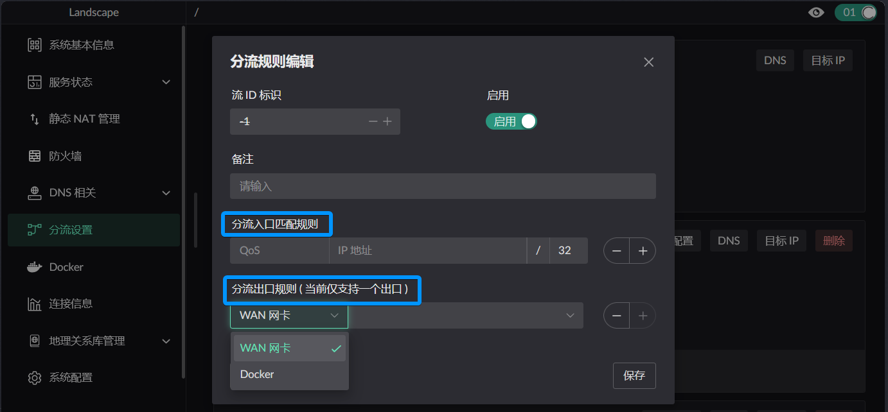
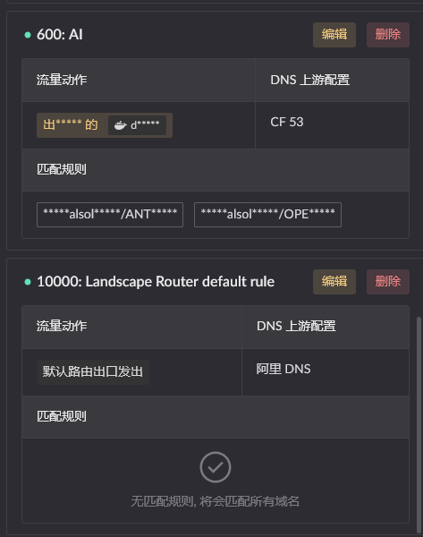
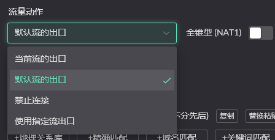
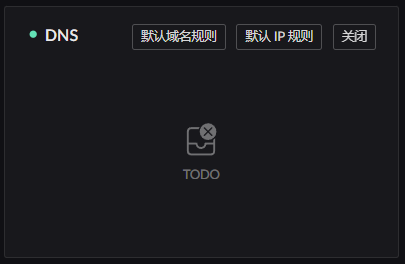
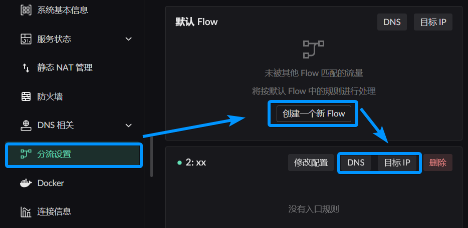

# 分流控制
分流可以`定义`一组目标 IP 行为, `应用`在一组客户端

> 有任何想法欢迎在此发布评论, 或者新建一个也是可以的: https://github.com/ThisSeanZhang/landscape/discussions/88

## 基础概念
* `Flow`: 一组策略，拥有入口和出口，中文 `流`
* `入口`: 一组过滤筛选客户端的规则, 使用 `IP 地址` 或者 `MAC` 进行匹配
* `出口`: Docker 容器 (容器中的程序需要与[接应程序](#接应程序镜像)配合使用), 或者某个 WAN 网卡. 当前没有多个出口负载, 只有单出口.
* `默认流`: Flow ***ID 0***，所有`未匹配`的流量，默认进入此流, 出口为拓扑中设置的`默认路由`, 比如 [PPPoE](../other-features/sys-info.md#设置-pppoe-网卡为默认路由-添加-pppoe-账号) 中启用 `设置默认路由` 开关
* `其他流`:Flow ***ID 1~255***，按入口规则匹配，匹配成功则进入此流
* `流内规则匹配方式`: 会检查 DNS 规则还有 IP 规则, 当同时满足两类规则时, 按照优先级选择 (优先级值越小越高)，匹配上即发送至出口，后续规则不再进行匹配（只会与一条规则匹配上）
* `优先级`: DNS / IP 规则的 index 值进行定义, 总条目数是 2^32, 当这个值重复时优先使用 DNS 动作处理.

## 流的定义
当我们在讨论分流时, 我们的关注点一般是. 从`什么客户端`来的流量, 到`哪个出口`出去. 而出口的选择依赖客户端访问的`目标`, 也就是 ***域名*** 或者是 ***IP***. (当然域名最后访问时也会变成 ***目标IP*** 再访问)

点击下图的按钮, 可以创建一个新的 Flow
  

将会弹出这个窗口
  

入口就是定义哪些符合的客户端将会使用这个流

出口就是当流量确定被这个流处理时, 当其中的规则`没有改变`该目标的动作, 则会使用哪个出口发出. 也就是这个流的默认出口.

并不是该入口的流量都从这个出口发出, 当怎么确定这些例外情况, 一般都是使用域名或者 IP 进行区分.

:::info
* 入口 / 出口 可以不进行配置  
* 当入口为空时, 仅定义出口时, 虽然没有进入的规则, 但是在其他流的规则中可以转发到这个流, 相对于使用了出口  
* 当出口为空时, 仅定义入口. 相对于进入这个流的流量默认是丢弃的, 除非使用了其他流的出口  
* 都不定义, 可以当作其他流转发过来丢弃  
:::

## 流怎么分
### DNS 规则描述
:::info
每个流中有独立的 DNS 缓存, 不用担心相同域名会导致不同流中的缓存相互覆盖.
:::

* 每一条 DNS 规则，可以定义这几个部分:
  1. 当遇到`什么域名`时这条规则`生效` -- 处理域名的匹配规则
  2. 当`解析`配置的这些域名时, 使用哪个`上游` -- DNS 上游选择
  3. 当`符合 Flow 入口的客户端`访问这个域名时, 使用哪个`出口`发送 -- 流量动作
  4. 当 DNS 解析的结果与 IP 规则中定义的冲突时, 哪个生效? -- 优先级 ( 将会比较 IP 规则和 DNS 规则中谁的优先级高(数值越小越高))
  
  

* 任何 Flow，应当至少有一条兜底 DNS 规则，用于处理当前域名没有匹配上任意一条规则时使用, 看起来是这样的



### 目标 IP 规则描述
目标 IP 规则的配置, 其实相对 DNS 规则只是少了上游的定义. 其他诸如 流量动作, 优先级. 是相同的概念就不再赘述了.

### 流量动作
Flow 中核心的概念就是这个, 控制当前规则的目标的具体行为.
  

* `默认流的出口`: 当前规则匹配上的域名或者 IP, 使用`当前 Flow` 中定义的出口发送
* `默认流的出口`: 当前规则匹配上的域名或者 IP, 使用`默认流`的出口发出
* `禁止连接`: 丢弃该数据包
* `使用指定的流出口`: 当前规则匹配上的域名或者 IP, 使用`所选流`的出口发出.   
  比如你有流 A / B, A 中定义 C 访问 D 网站时, 使用 B 的出口发出, 在这种情况下, C 访问非 D 网站时将使用 A Flow 中定义的出口, 而在访问 D 时, 则会使用 B 中定义的出口. 

```text
┌─────────────────────────────── Flow A (默认出口) ────────────────────────────────┐
│                                                                                 │
│   [C 发起访问] ───► 判断：目标 == D ? ───► 否 ───► 使用 A 出口发送                 │
│                     │                                                           │
│                     │ 是                                                        │
│                     ▼                                                           │
└─────────────────────────────────────────────────────────────────────────────────┘
                      │
┌─────────────────────────────── Flow B (特殊出口) ────────────────────────────────┐
│                      └──► 使用 B 出口发送                                        │
└─────────────────────────────────────────────────────────────────────────────────┘
```

## 规则设置的位置

### 默认流 Flwo 0 目的匹配规则 设置

通过主页右上方的 `DNS卡片` 进入配置   
  

### 其他流 Flow 1~255 目的匹配规则 设置

通过侧边栏的 `分流设置` 进入配置  
 
 

<!-- # 多个 Flow 组合
当流量进入容器后, 假设流量变为该 容器的 IP 进行发送, 那么可以新建一个 Flow 配置, 将该容器 IP 加入, 这样就能控制该容器发出流量的行为.
( 大多数情况应该属于多此一举 ) -->
## 如何使用 Docker 容器作为流出口

* 仅搭配 [**接应程序**](https://github.com/ThisSeanZhang/landscape/blob/main/landscape-ebpf/src/bin/redirect_pkg_handler.rs) 进行打包的容器，可作为有效的流 **出口容器**  
* 可挂载任意程序在 `/app/server` 目录下作为 **工作程序**, 需要自行编写 `/app/server/run.sh` 脚本用于启动
* **工作程序** 需监听 `12345` 端口作为 tproxy 入口, 其他端口需要通过环境变量 `LAND_PROXY_SERVER_PORT` 修改 **接应程序** 默认监听端口
* **接应程序** 会将待处理流量转发到 **工作程序** 的 tproxy 入口 
* landscape 0.6.7+ 版本容器出口默认为 Flow 0 出口  

### 接应程序（镜像）
项目提供了一个 **测试接应程序** 以便进行测试, [装有 **接应程序** 的镜像在此](https://github.com/ThisSeanZhang/landscape/pkgs/container/landscape-edge):

如果使用 UI 上的镜像运行界面运行, 记得点击按钮, 将会添加一个 label. (手动添加一个也可以, 后台运行时会自动添加,下方手动运行需要的设置)


当使用 UI 进行启动,并点击 label 添加后可以忽略, 如果使用第三方或者手动启动则需要注意添加以下参数:
* docker run
```shell
docker run -d \
  --name your_service \
  --sysctl net.ipv4.conf.lo.accept_local=1 \
  --cap-add=NET_ADMIN \
  --cap-add=BPF \
  --cap-add=PERFMON \
  --privileged \
  -v /root/.landscape-router/unix_link/:/ld_unix_link/:ro \ # 必要映射
  # 可挂载 任意工作程序及其启动脚本等所需文件
  ghcr.io/thisseanzhang/landscape-edge:amd64-xx # xx需修改为合适版本
```

* compose
```yaml
services:
  your_service:
    image: ghcr.io/thisseanzhang/landscape-edge:amd64-xx # xx需修改为合适版本
    sysctls:
      - net.ipv4.conf.lo.accept_local=1
    cap_add:
      - NET_ADMIN
      - BPF
      - PERFMON
    privileged: true
    volumes:
      - /root/.landscape-router/unix_link/:/ld_unix_link/:ro # 必要映射
      # 可挂载 任意工作程序及其启动脚本等所需文件
```
默认设置下， 容器有一个[**演示工作程序** ](https://github.com/ThisSeanZhang/landscape/blob/main/landscape-ebpf/src/bin/redirect_demo_server.rs) 放置在 `/app/server` 监听 `12345` 端口作为tproxy入口。

而 **接应程序** 是放置在 `/app`， 默认情况下是会将待处理流量转发到，演示 **工作程序** 监听端口 `12345`的tproxy入口。 可以通过设置容器的环境变量改变监听端口: `LAND_PROXY_SERVER_PORT`。

可将需要的 **工作程序** 挂载在 `/app/server` 目录下以替换 **演示工作程序**，将 **工作程序** 启动脚本挂载为 `/app/server/run.sh` ， `/app/start.sh` 默认会去执行`/app/server/run.sh`以启动 **工作程序** 或 **演示工作程序** 。


### /app/start.sh 文件（非 **工作程序** 启动脚本）

**[测试接应程序镜像](https://github.com/ThisSeanZhang/landscape/pkgs/container/landscape-edge)中已包含，无需自行添加/挂载**

```bash
#!/bin/bash

ip rule add fwmark 0x1/0x1 lookup 100
ip route add local default dev lo table 100

/app/server/run.sh /app/server &
/app/redirect_pkg_handler &

wait
```
